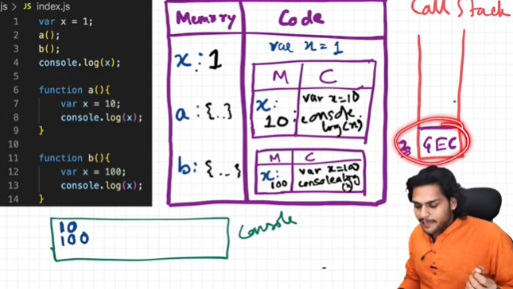
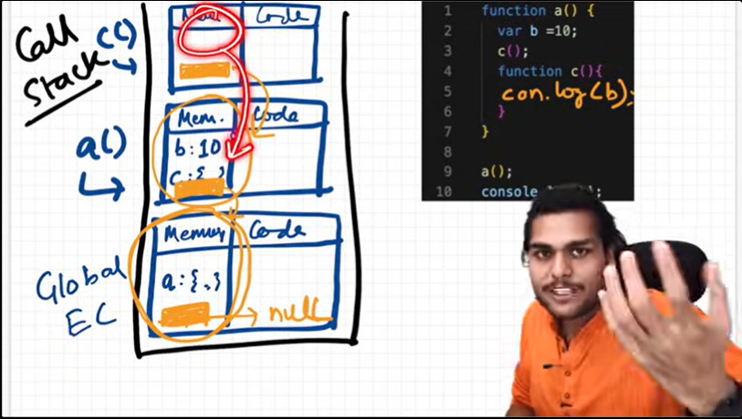

# 3 Hoistings

    - Hoisting is a Phenomenon in JS where You can access the variables and functions even before initializing them.

    - Everytime when a function invokation Happens a  new execution context.

# EP-04 | How functions work in JS ❤️ & Variable Environment

    - Whenever fucntion invokation happens A execution context is created and pushed inside call stack
    

# EP-05 | SHORTEST JS Program 🔥window & this keyword

    - Window is Global object created along with Global execution context
    - this is created for all Execution context [GEC, FEC];
    - this refers to the window object at Global level
    - Google uses v8 engine

# EP-06 | undefined vs not defined in JS 🤔

    - undefined is a placeholder for a variable that has been declared but not yet assigned a value.
    - not defined is an error that occurs when you try to access a variable that has not been declared at all.

    - JS is a looselly typed language which means you can assign any type of value to a variable without any error.

# EP-07 | The Scope Chain, 🔥Scope & Lexical Environment

    - Scope means where you can access a variable and function in your code.
    - Whenever a execution is created lexical envrionemnt also created
    - lexical means in sequence
    - Lexical envrionment is local memory + lexical environment of its parent
    - Global level lexical environment points to null

    - The scope chain is nothing but the chain of all this lexical environment and its parent references
    - 

# EP-08 | let & const in JS 🔥Temporal Dead Zone

    - let and const are hoisted but in diff way than VAR
    - let and const are in temporal dead zone in time Being
    - The phase from hoisting tilll it assigned some value that Phrase is known as temporal Dead zone
    - When variable are in temporal dead zone you cannot access it
    - Types of errors
    - Best way to avoid temporal dead zone is to initialize variable on top

# EP-09 | BLOCK SCOPE & Shadowing in JS 🔥

    - Also known as compound statement
    - Compound statemnt -> using group of Multiple statements Where JS expects One Statement
    - Blockscope- What all variable and function used inside Block;
    - Let and const Have blocked scope

    - Shadowing -----> When a variable inside a scope has the same name as one outside, hiding the outer variable.
    - We have 3 Scope in JS Global, Block, Function
    console.log(c);
    -

# EP-10 | Closures in JS 🔥

    - Function with its lexical Scope forms a closure.
    - A closure is the combination of a function bundled together (enclosed) with references to its surrounding state (the lexical environment).
    - We can Return a Function from inside a function
    - We can pass fucntion as argument.
    - when function is returned they still remmember its lexical scope

    # Uses of closures
        - module Design pattern
        - function Currying
        - function like Once
        - memoize
        - setTimeouts
        - Iterator

        - currying is a technique of evaluating function with multiple arguments into sequence of functions with single argument

# EP-11 | setTimeout + Closures Interview Question 🔥

    - Time tide and JS Waits for none
    - Settimeout inside a loop forms a closure and it will always refer to the last value of the variable in the loop
    - Closure  =  function + lexical scope [It remmebers reference to its lexical variables]
    - We can form a closure by using function which takes new copy of variable in each iteration

# EP-12 | CRAZY JS INTERVIEW 🤯ft. Closures

    - Whenever a function invoked it creats a copy of all its variables in its lexical scope

    - Garbage collector  is a program in js engine which frees up the memory When it found unused variables and functions
    - If we forms closures it accumulates large memory

# EP-13 | FIRST CLASS FUNCTIONS 🔥ft. Anonymous Functions

    - Major diff between Function Statement and fucntion expression is Hoisting
    - function statement --> function declaration is hoisted and can be called before its declaration
    - function expression --> function expression is not hoisted and cannot be called before its declaration
    - Anonymous function ---> function with no name

    - firstClass function or function first Class Citizen ----> function that can be treated as a value and can be passed as an argument to another function or returned from another function

# EP-14 | Callback Functions in JS ft. Event Listeners 🔥

    - JS is a synchronous single threaded language with the help of callback functions, setTimeout Opens the door for Asynchronous programming in JS
    - A callback function is a function that is passed as an argument to another function and is executed after some operation has been completed.
    - Callback functions are commonly used in asynchronous programming to handle events or perform actions after a certain task is completed.

    - Event Listeners are functions that are called when a specific event occurs on an element, such as a click or a keypress. They allow you to respond to user interactions and perform actions based on those interactions.

    - Js  have just One call stack [Main Thread]

    - Event listners are heavy and they can cause performance issues if not used properly. It's important to remove event listeners when they are no longer needed to free up memory and improve performance.

# EP-15 | Asynchronous JavaScript & EVENT LOOP from scratch 🔥

    - Browser is the most remarkable creation of mankind
    - Callback Queue -> Executes lower-priority async tasks (like setTimeout, events) after microtasks are completed.
    - Microtask Queue -> Promises and Mutation Observer
    - starvation of callback queue can happen when microtask queue is continuously filled with tasks, preventing callback queue tasks from executing.

# EP-16 | JS Engine EXPOSED 🔥 Google's V8 Architecture 🚀

    - EcmaScript --> ECMAScript is the official standard/specification that defines how JavaScript should work.
    - Every browser has its own JS engine that implements the ECMAScript specification. For example, Google Chrome uses the V8 engine, Firefox uses SpiderMonkey, and Safari uses JavaScriptCore (also known as Nitro).

# EP-17 | TRUST ISSUES with setTimeout()

    - setTimeout waits for all syncronous code to execute before it executes its callback functions.
    - setTimeout with 0 delay will still execute after all synchronous code has completed, which can lead to unexpected behavior if you rely on it for timing-sensitive operations.
    - setTimeout 0 can be used when we want to defer some piece of code

# EP-18 | Higher-Order Functions ft. Functional Programming

    - A higher order fucntion is a function that takes function as an argument or returns a function.
    - DRY Principle --> DO NOT REPEAT YOURSELF
    - In higher order function we try to make code more modular

# EP-19 | map, filter & reduce 🙏

    - map function takes an callback function and iterate on every index of array
    - filter function also takes an callback func and filter out the values accoridnng to callback
    - Reduce function takes acc, curr and iterates
    - map chaining
